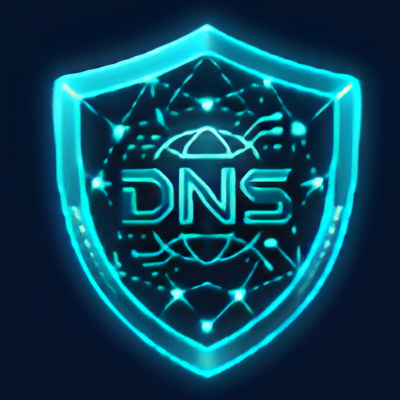
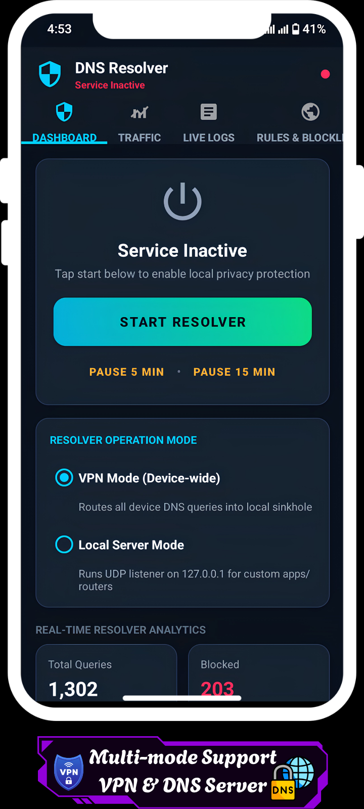
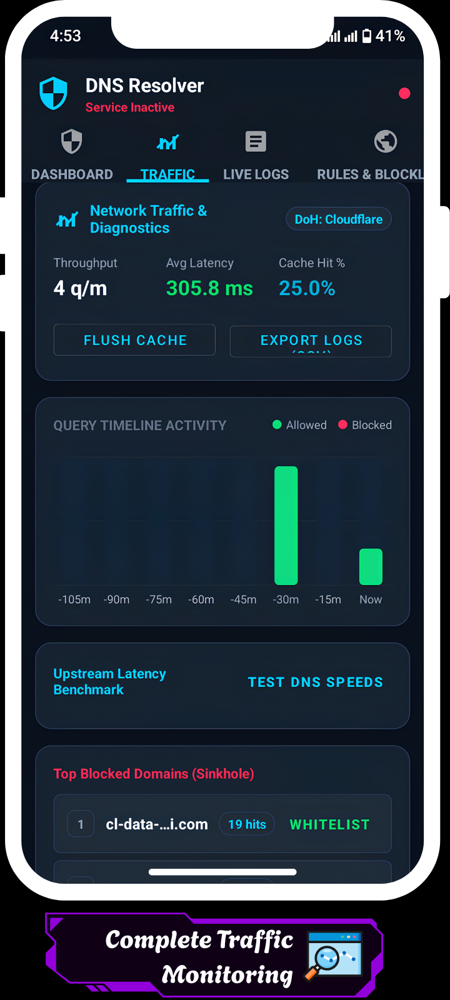
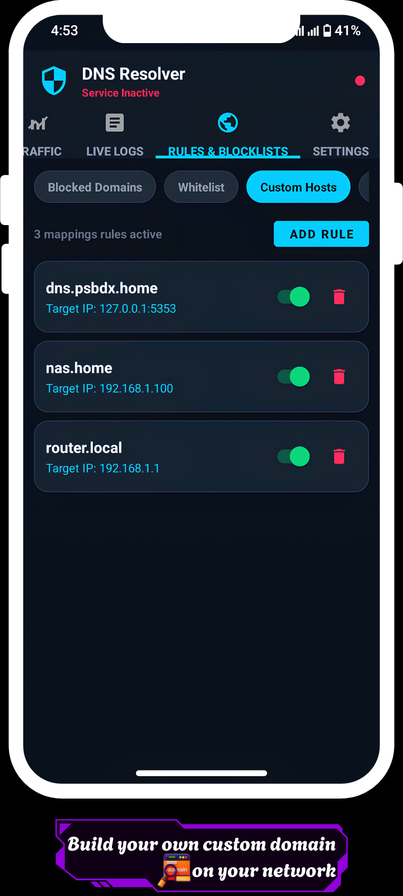
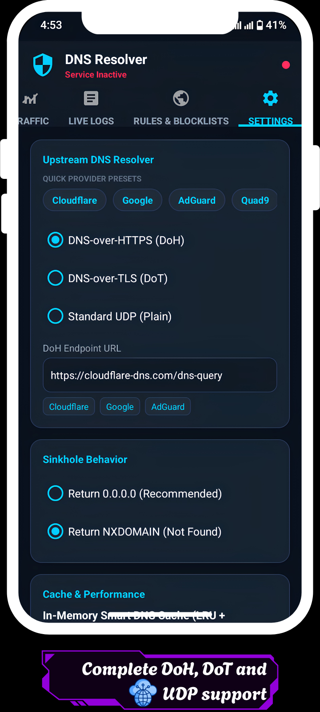
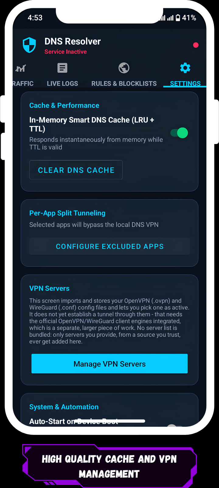
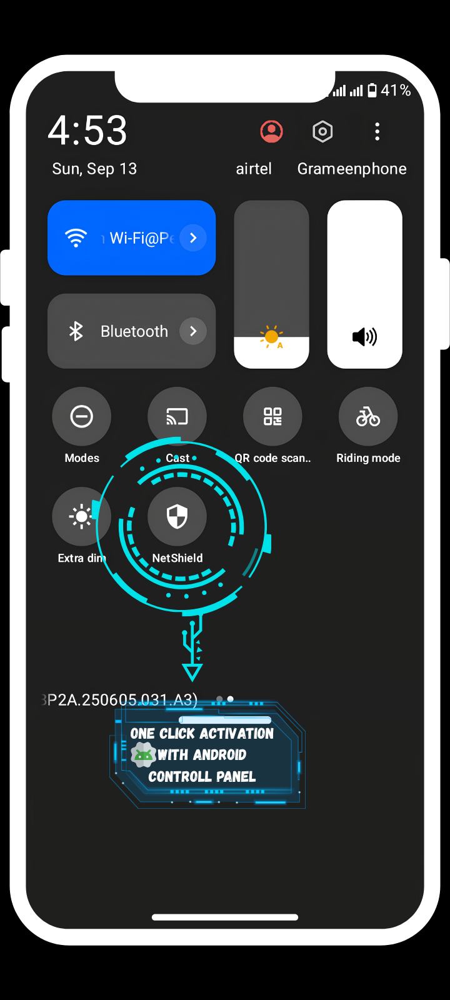
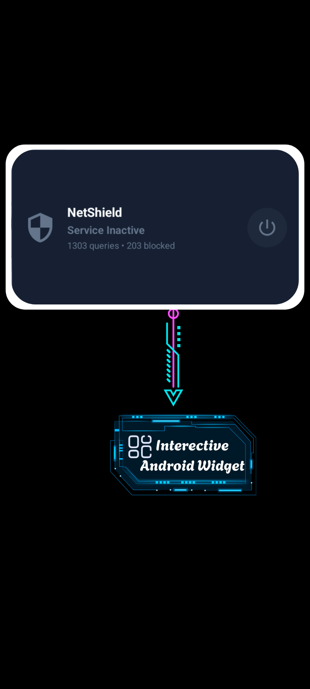

<div align="center">



# NetShield DNS Resolver


**A local DNS resolver, ad/tracker sinkhole and live traffic dashboard for Android.**

Private, open source, and built in pure Java. No Firebase, no Google Play Services, no tracking.

<br>

[](https://github.com/m-farhan-hamim/NetShield-DNS-Resolver-by-PSBDx/releases/tag/3.0.0)
[](LICENSE)
[](https://www.android.com)
[](https://www.java.com)

[](https://www.virustotal.com/gui/file/378b86f21d3e4cddae92fe67eef3bfc17ebb335d6db3963e20338c97a4335640/)
[](https://f-droid.org)
[](https://apkpure.com/p/com.netshield.dns.psbdx)
[](https://github.com/m-farhan-hamim/NetShield-DNS-Resolver-by-PSBDx/releases/latest)

<br>

[Features](#features) •
[Screenshots](#screenshots) •
[Download](#download) •
[How it works](#how-it-works) •
[Build](#building-from-source) •
[Verify](#verify-your-download) •
[License](#license)

</div>

---

<a id="features"></a>
##  Features

| | Feature | Description |
|---|---|---|
|  | **DNS sinkhole** | Blocks ads, trackers and unwanted domains at the DNS level, for every app on the device. |
|  | **VPN mode** | Routes all system DNS queries through a local sinkhole using Android's VPN API. Nothing leaves your device except the DNS queries you allow. |
|  | **Local server mode** | Prefer no VPN? Run as a local UDP DNS server on `127.0.0.1`. |
|  | **Encrypted upstreams** | Resolve through **DoH** (DNS over HTTPS), **DoT** (DNS over TLS) or plain **UDP**. |
|  | **Custom blocklists** | Add your own blocklists and rules. |
|  | **Per-app split tunneling** | Choose which apps go through NetShield and which bypass it. |
|  | **Real-time traffic logs** | Live dashboard with query logs and stats so you can see what your apps are talking to. |
|  | **Quick Settings tile** | Toggle NetShield from the notification shade in one tap. |
|  | **Home-screen widget** | Resizable card with live status, query stats and a power button. |
|  | **Lightweight and clean** | Pure Java, only AndroidX and Material. No Kotlin, no Compose, no Firebase, no Google Play Services. |

---

<a id="screenshots"></a>
##  Screenshots

<div align="center">










</div>

---

<a id="download"></a>
##  Download

| Source | Link |
|---|---|
| **F-Droid** | [Get it on F-Droid](https://f-droid.org) |
| **APKPure** | [com.netshield.dns.psbdx on APKPure](https://apkpure.com/p/com.netshield.dns.psbdx) |
| **GitHub Releases** | [Latest signed APK](https://github.com/m-farhan-hamim/NetShield-DNS-Resolver-by-PSBDx/releases/latest) |

**Package name:** `com.netshield.dns.psbdx`
**Current version:** `3.0.0`

>  Whichever source you use, you can [verify the APK's signing certificate](#verify-your-download) before installing.

---

<a id="how-it-works"></a>
##  How it works

NetShield sits between your apps and the internet's DNS servers:

```
  Apps  ──►  NetShield (local sinkhole)  ──►  Upstream DNS (DoH / DoT / UDP)
                    │
                    ├─ blocked domain?  → answered locally, never leaves the device
                    └─ allowed domain?  → forwarded upstream, logged in the dashboard
```

- **VPN mode:** a local VPN interface captures system DNS queries and hands them to the resolver. No traffic is tunneled to a remote server.
- **Local server mode:** the resolver listens on `127.0.0.1` as a UDP DNS server that you can point apps or system settings at.
- **Split tunneling:** exclude specific apps so their DNS queries skip NetShield entirely.

---

##  Quick Settings tile and widget

Beyond the in-app Start/Stop button, the resolver can be toggled with a single tap from:

- **Quick Settings:** add the "NetShield" tile from the panel's edit screen. It reflects the Active/Inactive state live.
- **Home-screen widget:** a resizable card showing live status and query stats, with a dedicated power button to toggle instantly. Tapping the rest of the card opens the app.

Both use the same underlying `ServiceManager.ACTION_STOP` self-stop mechanism as the in-app button, so behavior stays consistent everywhere. If VPN mode hasn't been granted permission yet, tapping either will briefly open the app to complete the one-time system consent dialog, then behave identically afterward.

---

##  In-app update checker

On launch, the app checks `GET /repos/m-farhan-hamim/NetShield-DNS-Resolver-by-PSBDx/releases/latest` and compares the release tag against the installed `versionName`. If a newer version exists, a banner offers to download and install it via the system package installer (using a `FileProvider`).

> **Disabled for F-Droid installs, on purpose.** F-Droid's client already verifies and delivers updates from its own build, so self-updating apps aren't wanted there. `UpdateChecker.isSelfUpdateAllowed()` checks the installer package name (`getInstallSourceInfo` / `getInstallerPackageName`), and the whole feature is a silent no-op when it is `org.fdroid.fdroid`. Keep this check in place for F-Droid builds.

---

<a id="building-from-source"></a>
##  Building from source

Pure Java, no Kotlin, no Compose, no Firebase or Google Play Services. Just AndroidX and Material.

```bash
git clone https://github.com/m-farhan-hamim/NetShield-DNS-Resolver-by-PSBDx.git
cd NetShield-DNS-Resolver-by-PSBDx
./gradlew :app:assembleDebug
```

A release build works without any secrets configured (it just produces an unsigned APK):

```bash
./gradlew :app:assembleRelease
```

For a locally signed release build, set these environment variables:

| Variable | Purpose |
|---|---|
| `KEYSTORE_PATH` | Path to your keystore file |
| `RELEASE_STORE_PASSWORD` | Keystore password |
| `RELEASE_KEYALIAS` | Key alias inside the keystore |
| `RELEASE_KEY_PASSWORD` | Key password |

### CI and releases

The `release` job in `.github/workflows/build.yml` builds a signed production APK and AAB on every push to `main`/`master` (and on manual `workflow_dispatch` runs), using these GitHub Actions secrets:

- `KEYSTORE_BASE64`: your upload keystore, base64-encoded (`base64 -w0 your-key.jks > keystore.b64` on Linux/macOS)
- `RELEASE_KEYALIAS`: the key alias inside that keystore
- `RELEASE_KEY_PASSWORD`: the key's password
- `RELEASE_STORE_PASSWORD`: the keystore's password

Pull requests from forks can't access these secrets, so they only get the unsigned debug build. That's expected.

Push a tag matching `versionName` in `app/build.gradle.kts` (for example `3.0.0`) and the workflow also publishes a GitHub Release with the signed APK attached. That's what the in-app update checker looks for.

---

<a id="verify-your-download"></a>
##  Verify your download

Official releases are signed with the same key. The SHA-256 fingerprint of the signing certificate is:

```
21:53:E6:6A:EA:E3:09:50:5C:8A:1C:21:76:66:B2:E4:64:01:28:29:0C:81:FF:E2:A4:0D:FF:75:E4:ED:62:A9
```

Check an APK with the Android SDK's `apksigner`:

```bash
apksigner verify --print-certs app-release.apk
```

The `SHA-256 digest` line in the output should match the fingerprint above. If it doesn't, don't install the file.

---

##  Contributing

Contributions are welcome.

1. Fork the repo and create a branch: `git checkout -b feature/my-change`
2. Make your changes and test with `./gradlew :app:assembleDebug`
3. Open a pull request describing what you changed and why

Found a bug or have an idea? [Open an issue](https://github.com/m-farhan-hamim/NetShield-DNS-Resolver-by-PSBDx/issues).

---

<a id="license"></a>
##  License

Licensed under the **GNU General Public License v3.0 or later**. See [`LICENSE`](LICENSE) for the full text. Free and open source.

---

##  About / Disclaimer

This app was built by **PSBDx** ([M. Farhan Hamim](https://github.com/m-farhan-hamim)). Significant use of Google AI was made in its development.

<div align="center">

<br>

**Made with**  **by [PSBDx](https://psbdx.xyz)**

</div>
